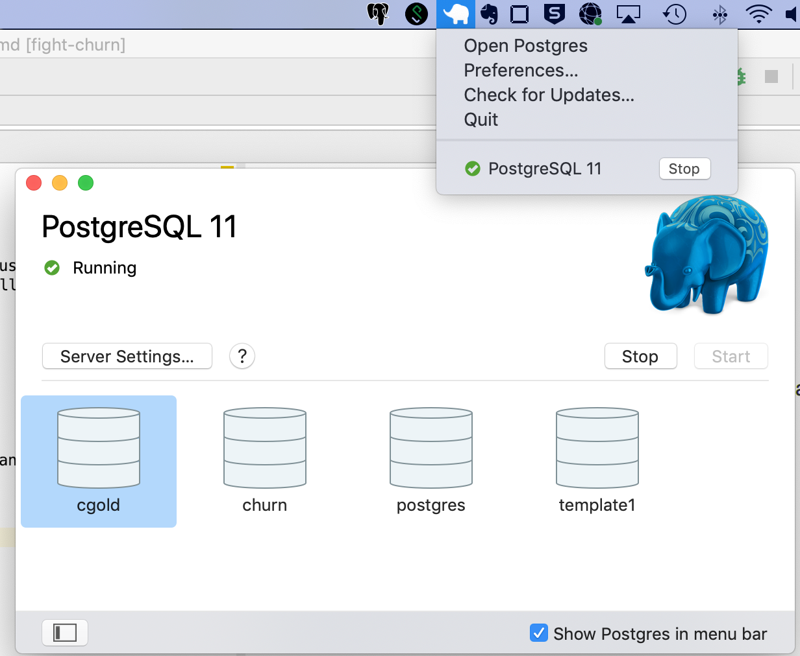
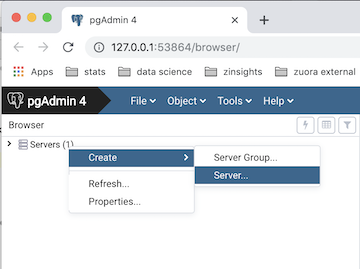
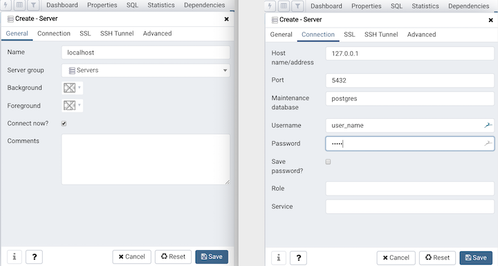
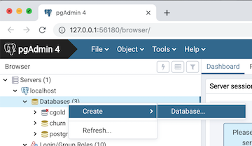
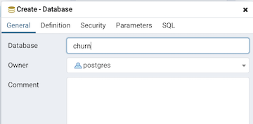

# fight-churn

<a name="top"/>

This is code for the book "***Fighting Churn With Data: Science and strategy for keeping your customers***"; the book serves as a detailed guide to the code.  You can get more information at:

- https://www.manning.com/books/fighting-churn-with-data, the publisher (Manning Publications)'s page for the book
- http://www.fightchurnwithdata.com, the author's blog site
- https://www.twitch.tv/carl24k_datascience, the author's live stream

This page contains the most up to date setup instructions, as well as information about some extra code that is mentioned in the book.

*WARNING TO PYPI USERS: None of the links or images in this document work on the pypi.org website! 
[To 
use the links in this README view it on github](https://github.com/carl24k/fight-churn/tree/20210605_packaging#fight-churn).*

**Quick Start Setup Instructions**  

[0 Getting Started](#start)  
[1 Prerequisites](#prereq)  
[1.1 Python 3](#python)  
[1.2 Postgres](#postgres)  
[1.2.1 Database Setup](#createdb)  
[2 Quickstart With Python Package](#package)  
[2.1 Create a virtual environment](#virtual)  
[2.2 Install the fightchurn package](#fightchurn)  
[2.3 Create a directory for output](#output)  
[2.4 Start the Python virtual environment](#startvirtual)  
[2.5 Import the run_churn_listing_module](#import)  
[2.6 Set the churn environment variables](#envvar)  
[2.7 Run the data simulation](#simulate)  
[2.8 Run code listings](#run)  

**Advanced Setup Instructions**  

- [Notebook Setup](readme_files/notebook.md)
- [Developers IDE Setup](readme_files/ide.md)
- [Command Line Setup](cmdline.md)
- [Extras](readme_files/extras.md)

*WARNING TO PYPI USERS: None of the links or images in this document work on the pypi.org website! 
[To 
use the links in this README view it on github](https://github.com/carl24k/fight-churn/tree/20210605_packaging#fight-churn).*


---
<a name="start"/>

## 0 Getting Started

Note from the author: These are basic startup/setup instructions that I think should work for most people using either shell Python, Jupyter Notebook, or an IDE, on either Mac or Windows.  I also want to apologize in advance because I am neither an expert in PostgreSQL nor an expert in Python, but I am about to give a lot of advice on how to setup and use these technologies - if you find I am not doing things the best way, or just not how you would have done it, please be patient.  Same goes for the rudimentary state of some of the code - I'm doing the best I can with the time I've got.  If you want to make things better please help help out! :)

Before you can load data or run the code you have to do some setup on your system. If you never have 
done this before it may seem like a lot of work, and it kind of is, but this amount of setup is routine
when you begin to work with a new technology.  If already know how to do this sort of thing feel free
to ignore my instructions, which are primarily written for beginners to use GUI tools to get up and
running.


---
---

<a name="prereq"/>

### 1 Prerequisites


Required:
* 12 Gb free disk space for the simulation data
* Python 3 and the required packages (requirements.txt)
* PostgreSQL

Recommended:
* PgAdmin - for PostgreSQL database setup
* PyCharm (Community Edition)   OR  Jupyter Notebooks - for running Python programs
  * If you have never used Python before (or used Python and never used Jupyter) then start with the PyCharm because it is an all GUI set up process. Jupyter instructions are provided below for those who are already familiar with it.

---
<a name="pyton"/>

#### 1.1 Python 3

If you need help installing Python 3, you can refer to this page for Mac:
* https://docs.python-guide.org/starting/install3/osx/

Another good alternative for Mac is using Homebrew:

* To install homebrew see: https://brew.sh/
* For information on installing Python 3.9: https://formulae.brew.sh/formula/python@3.9

For Windows there are resources here:

* https://www.python.org/downloads/windows/

(If you are on linux I'm going to assume you know how to install your own python...)

##### Note about Python and Package versions

Nearly all of the code for Fighitng Churn With Data should run with any Python 3.x version and all common package versions.

The only packages used that have version dependencies are the `xgoost` and and `shap` packages introduced in the later listings of chapter 9. These packages contain recent updates and  may only be compatible with versions of Python later than 3.9, at the time of this writing. *Note `xgboost` has other installation issues on Windows and Mac platforms, as described below in the section "Installing Virtual Environment and Requirements"*.

Please create an issue in the repository if you find any other instances of package or version incompatibilities.

---

<a name="postgres"/>

#### 1.2 PostgreSQL

To install PostgreSQL for Mac following these instructions:

* https://postgresapp.com/downloads.html

To install PostgreSQL for Windows, use :

* https://www.enterprisedb.com/downloads/postgres-postgresql-downloads

(That page has a different Mac installer if you don't like Postgresapp.)

For both Mac and Win, I also recommend installing installing pgAdmin to make it easier to import and export
data, and run adhoc queries.  Follow the instructions  here:

* https://www.pgadmin.org/download/

For Mac you should make sure Posgres is running - here's what it looks like if you installed with
PostgresApp on a Mac:



For Windows, I have not yet figured out how to make sure Postgres is running, but I also have not yet had a
problem with it not running (please notify me if you have something to contribute on either subject.)

---
---

<a name="createdb"/>

#### 1.2.1 Creating a Database

The first thing you might need to do is connect to your local server (when I do this on Mac this is necessary;
on Windows, the connection to the localhost server was already present by default.)
If you don't already see `localhost` under the Servers tree in Pgadmin,  control (right)
clicking on the root of the Servers tree and selecting *Create*



A dialog will open. Assuming you are working on a PostgreSQL database installed on your own computer then  
in the first tab (*General*) name your connection `localhost`, and on the second tab (*Connection*) enter the
address `127.0.0.1` (which is the IP address to connect to a database locally.) You should also enter your
user name and password.  So your dialog should look like the one below - then hit *Save*.




Next you need to create a new database to hold all of the churn data schemas you create.
You will probably create multiple schemas as you work on the examples in the book and/or your own
data so this will help keep these organized.  An easy way to create a database is in PgAdmin - right click
on the *Databases* node under *localhost* in the tree:



And enter the name of the new database (I used churn, but you can use whatever you want - just make the
appropriate settings in your environment variable, section 1.2.2.3 below):




---
---

<a name="package"/>

## 2 Quickstart With Python Package


---

<a name="virtual"/>


### 2.1 Create a virtual environment

```shell
python3 -m venv churn_env
```

---

<a name="fightchurn"/>

### 2.2 Install the fightchurn package

```shell
pip install fightchurn
```

__**Windows XG-Boost Warning:**__ At the time of this writing there have been problems reported 
 installing the xgboost package on  Windows: https://discuss.xgboost.ai/t/pip-install-xgboost-isnt-working-on-windows-x64/57.
If you are unable to install xgboost with pip, then you can try to install using the instructions
  outlined in that link. Alternatively, you can remove that requirement - note that you can
still run all the code in the book except for the 2nd half of chapter 9 without xgboost.

__**Mac XG-Boost Warning:**__ At the time of this writing there have been problems reported 
 installing the xgboost package on recent versions of  Mac OS: https://stackoverflow.com/questions/61971851/getting-this-simple-problem-while-importing-xgboost-on-jupyter-notebook
If you are unable to install xgboost with pip, try performing the Lib OMP installation described above first. Alternatively, you can remove the xgboost requirement - note that you can
still run all the code in the book except for the 2nd half of chapter 9 without xgboost.


---

<a name="output"/>

### 2.3 Create a directory for output

```shell
mkdir my_churn_output_folder
```


---

<a name="startvirtual"/>


### 2.4 Start the Python virtual environment

```shell
source churn_env/bin/activate
python
```


---

<a name="import"/>


### 2.5 Import the run_churn_listing_module

```python
from fightchurn import run_churn_listing
```

---

<a name="envvar"/>


### 2.6  Set the churn environment variables


```python
run_churn_listing.set_churn_environment('churn','user','password','/path/to/my_churn_output_folder')
```


---

<a name="simulate"/>

### 2.7 Run the data simulation


```python
run_churn_listing.run_standard_simulation(init_customers=10000)
```


---

<a name="run"/>

### 2.8 Run code listings


```python
run_churn_listing.run_listing(2,1)
```

---

## Authors

* **Carl Gold** [carl24k](https://github.com/carl24k)

## License

This project is licensed under the MIT License - see the [LICENSE.md](LICENSE.md) file for details


[(top)](#top)  
