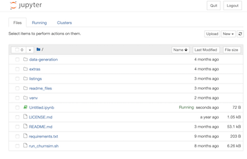
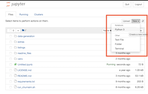
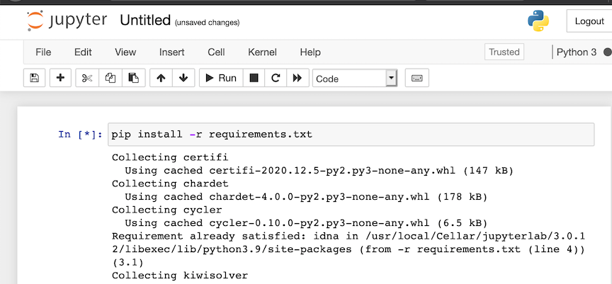
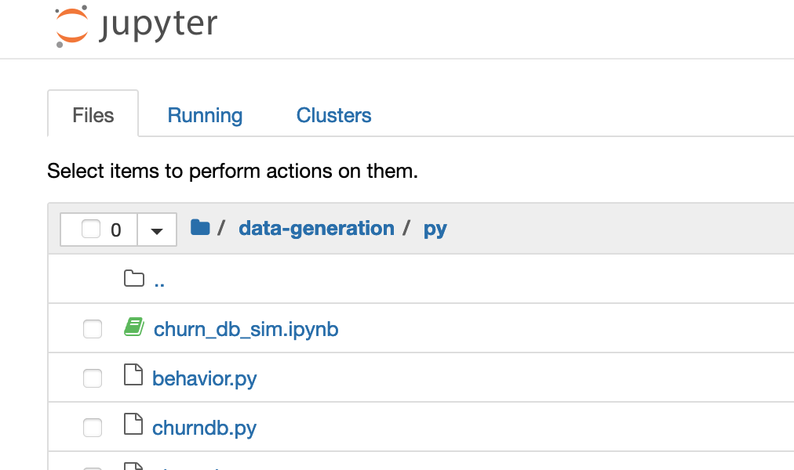
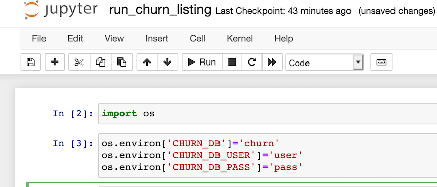
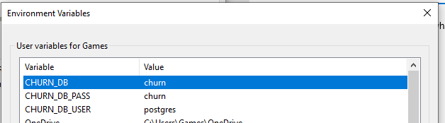

# fight-churn

<a name="top"/>

This is code for the book "***Fighting Churn With Data: Science and strategy for keeping your customers***"; the book serves as a detailed guide to the code.  You can get more information at:

- https://www.manning.com/books/fighting-churn-with-data, the publisher (Manning Publications)'s page for the book
- http://www.fightchurnwithdata.com, the author's blog site
- https://www.twitch.tv/carl24k_datascience, the author's live stream

This page contains the most up to date setup instructions, as well as information about some extra code that is mentioned in the book.

**Setup Instructions**  
[1 Getting Started](#start)  
[1.1 Prerequisites](#prereq)    
[1.2 Development Environment Setup](#devenv)      
[1.2.1 Database Setup](#createdb)      
[1.2.2 PyCharm Setup](#pycharm)      
[1.2.3 Jupyter Notebook Setup](#notebook)      
[1.2.4 Command Line Setup](#command)      
[1.3 Data Creation / Loading](#data)  
[2 Running Book Code Listings](#examples)  
[2.1 Running a Listing](#runlist)  
[2.2 Configuring How Listings are Run](#conflist)  

[Extras](readme_files/extras.md)


---
<a name="start"/>

## 1 Getting Started

Note from the author: These are basic startup/setup instructions that I think should work for most people using either shell Python or an IDE, on either Mac or Windows. (I would like to give Jupyter Notebook setup instructions in the future - if you have done it, please contact me.)  I also want to apologize in advance because I am neither an expert in PostgreSQL nor an expert in Python, but I am about to give a lot of advice on how to setup and use these technologies - if you find I am not doing things the best
way, or just not how you would have done it, please be patient.  Same goes for the rudimentary state
of some of the code - I'm doing the best I can with the time I've got.  If you want to make things better please help help out! :)


---
---

<a name="prereq"/>

### 1.1 Prerequisites


Required:
* 12 Gb free disk space for the simulation data
* Python 3 and the required packages (requirements.txt)
* PostgreSQL

Recommended:
* PgAdmin - for PostgreSQL database setup
* PyCharm (Community Edition)   OR  Jupyter Notebooks - for running Python programs
  * If you have never used Python before (or used Python and never used Jupyter) then start with the PyCharm because it is an all GUI set up process. Jupyter instructions are provided below for those who are already familiar with it.

---
#### 1.1.1 Python 3
If you need help installing Python 3, you can refer to this page for Mac:
* https://docs.python-guide.org/starting/install3/osx/

For Windows there are resources here:
* https://www.python.org/downloads/windows/

(If you are on linux I'm going to assume you know how to install your own python...)

##### Note about Python and Package versions

Nearly all of the code for Fighitng Churn With Data should run with any Python 3.x version and all common package versions.

The only packages used that have version dependencies are the `xgoost` and and `shap` packages introduced in the later listings of chapter 9. These packages contain recent updates and  may only be compatible with versions of Python later than 3.9, at the time of this writing. *Note `xgboost` has other installation issues on Windows and Mac platforms, as described below in the section "Installing Virtual Environment and Requirements"*.

Please create an issue in the repository if you find any other instances of package or version incompatibilities.

##### Python IDE

I also recommend installing an Integrated Development Environment like PyCharm. PyCharm 
**Community Edition** was used by the author to write and run
all the code for the book, so this README will include how to setup PyCharm (this is especially useful if you 
are new to Python, since an IDE can take care of some of the setup for you...)

* https://www.jetbrains.com/pycharm/download

---
#### 1.1.2 PostgreSQL
To install PostgreSQL for Mac following these instructions:

* https://postgresapp.com/downloads.html

To install PostgreSQL for Windows, use :

* https://www.enterprisedb.com/downloads/postgres-postgresql-downloads

(That page has a different Mac installer if you don't like Postgresapp.)

For both Mac and Win, I also recommend installing installing pgAdmin to make it easier to import and export
data, and run adhoc queries.  Follow the instructions  here:

* https://www.pgadmin.org/download/

For Mac you should make sure Posgres is running - here's what it looks like if you installed with
PostgresApp on a Mac:


For Windows, I have not yet figured out how to make sure Postgres is running, but I also have not yet had a
problem with it not running (please notify me if you have something to contribute on either subject.)

---
---

<a name="devenv"/>

### 1.2 Development Environment Setup

Before you can load data or run the code you have to do some setup on your system. If you never have 
done this before it may seem like a lot of work, and it kind of is, but this amount of setup is routine
when you begin to work with a new technology.  If already know how to do this sort of thing feel free
to igonre my instructions, which are primarily written for beginners to use GUI tools to get up and
running.

---
<a name="createdb"/>

#### 1.2.1 Creating a Database

The first thing you might need to do is connect to your local server (when I do this on Mac this is necessary;
on Windows, the connection to the localhost server was already present by default.)
If you don't already see `localhost` under the Servers tree in Pgadmin,  control (right)
clicking on the root of the Servers tree and selecting *Create*


A dialog will open. Assuming you are working on a PostgreSQL database installed on your own computer then  
in the first tab (*General*) name your connection `localhost`, and on the second tab (*Connection*) enter the
address `127.0.0.1` (which is the IP address to connect to a database locally.) You should also enter your
user name and password.  So your dialog should look like the one below - then hit *Save*.


Next you need to create a new database to hold all of the churn data schemas you create.
You will probably create multiple schemas as you work on the examples in the book and/or your own
data so this will help keep these organized.  An easy way to create a database is in PgAdmin - right click
on the *Databases* node under *localhost* in the tree:


And enter the name of the new database (I used churn, but you can use whatever you want - just make the
appropriate settings in your environment variable, section 1.2.2.3 below):


---
<a name="pycharm"/>

#### 1.2.2 Pycharm Setup

After you have cloned this repository

1. launch PyCharm and go to the menu *File* / *New Project*
1. In the file section window, select the folder for the repo.  Leave it set to "Create New Virtual environment for this project"
1. Click **Create**
1. It should say "The directory ... is not empty.  Would you like to create a project from existing sources?"  Click Yes


---
##### 1.2.2.1 Setup Python Project in Pycharm

You should create a Python "virtual environment" for the project (I won't try to go into details here,
but this allows you to install the packages used for the repo without interfering with anything else
on your system).  

In PyCharm, select from the menus: 

- Mac:  *Pycharm*  / *Preferences...*  and go to the area for *Project*
- Windows:   *File*  / *Settings...*  and go to the area for *Project*


If you click on the gear wheel to the right of where it says <No Interpreter> you have the option to add
a new one...


It will look something like this:


And after you click **Okay** it will take several seconds to create the virtual environment, and
then it should look like this:


You will add more packages in a minute, but first finish with the project setup by going to the
*Project Structure* section of the preferences:


Select each folder that contains python source code, and click on the button *Sources*
(with the blue folder next to it):


You should select the following folders:
* data-generation/py
* listings/py
    * listings/chap3
    * listings/chap5
    * listings/chap6
    * listings/chap7
    * listings/chap8
    * listings/chap9
    * listings/chap10

When you are done your project preferences should look like this:


---
##### 1.2.2.2 Installing Python Package Requirements in Pycharm

Now that you have created a Python project you can easily install the
required packages.  

1. Start by opening the Python file *data-generation/py/churndb.py* . At this point you are not going to use it, but PyCharm might not do the requirements for you if you don't have a Python file open. (Thats actually a weird PyCharm gotcha.) At this point it should give you a bunch of message about Installing requirements at the top. 
2. Now, go ahead and opena the file *requirements.txt* in the root project folder - these are the packages you will install.
3. 
4. Notice that at the top it says: *Install requirements* - click on that and the click
   **Install** in the dialog that comes up. Note that you have to be connected to the internet for
   this to work, and it will take several minutes for all the packages to be downloaded 
   and installed.


---
##### 1.2.2.3 Creating Run Configurations and Setting Database Environment Variables

A lot of the python code depends on access to the database you created for the churn data.
You will set environment variables that will hold your database and login information, so that
it does not have to be hard coded.  The easiset way to do this in PyCharm is to
set environment variables when you create a Run Configuration for the executables.

Here is one example of creating a run configuration for one of the programs: If you have not created any Run Configurations yet, you start with menu options `Run > Edit Configurations` as shown in pic below:


In the Run/Debug Configuration dialog click the **+**  then **Python** to make a new python script configuration.


You will get an empty configuration, and the first thing to do is click on the Folder icon in the 
script path text box and pick the script path.  The first script everyone will need to run is 
*data-generation/py/churndb.py*, which creates a schema for an analysis.  After selecting this script, your
configuration should look like this, with both the script path and the working directory set to 
wherever the script is on your system:


The next step is to add the environment variables, by clicking on the *Browse* button at the end
of the environment variables text box:


That button launches a dialog to add the environment variables.  You need to add three:
1.  CHURN_DB  : the name of the database for your churn analysis schemas (step 1.2.1 above)
1.  CHURN_DB_USER : the user name to login to the database
1.  CHURN_DB_PASS : the password to login to the database

After setting these, your environment variable dialog should look something like this:


Select **OK** and save all the configuration changes.  I'll say more about running this script in the 
next section on Data Loading / Creation.

------

##### 1.2.2.4 Duplicating Run Configurations

For creating additional Run configurations, note that PyCharm allows you to duplicate 
and modify an existing configuration.  So when you want to make another script with the same environment
variables open the Configuration Dialog, now by clicking on the run configuration drop down then selecting 
**Edit Configuration**


Now choose to duplicate your existing Run configuration:


This will make another configuration the same as the existing one - you can rename it and reset the 
path to a different script, keeping the environment variables you already setup.

- Duplicating run configurations saves you the trouble of re-entering the environment variables

One last thing: After creating the Run Configuration you actually run a script in PyCharm
using menu configurations `Run > Run 'churndb'` as shown in pic below:


---
---


<a name="notebook"/>

#### 1.2.3 Jupyter Notebook Setup

These instructions assume you already have Jupyter Notebooks installed. If you don't then you can consider the resources at https://jupyter.org/install. 

##### 1.2.3.1 Installing Packages Under Jupyter

1. launch a Jupyter  notebook from the project root directory. It should look like the view shown below : 

   
1. Start a new notebook from here (new button on the upper right...)

   
1. To install the required packages, run `pip install -r requirements.txt`

   

##### 1.2.3.2 Opening the Notebook & Setting the environment variables

1. Change the current directory to `data-generation/py`

2. 

3. Open the Notbook `churn_db_sim.ipnyb`

4. In the second cell, change the environment variables to match the database, username and password that you have created...

   
   
5. Run the first two cells to set the environment variables. You will need to re-run these cells every time you re-open the notebook, and the similar notebook that you use to run the listings.

6. The first program to run, which will create the required database tables, is in the next cell of the notebook - this is explained in more detail below in section 1.3.1.

------

------


<a name="command"/>

#### 1.2.4 Running From the Command Line

If you are not using PyCharm of course you can run all this code from a terminal shell. You will need
to manually setup a Python virtual environment with the required packages, and  set a few environment variables.

---

##### 1.2.4.1 Installing Virtual Environment and Requirements

In either Windows or Mac/Linux you should setup a virtual environment following the 
instructions at pythong.org:

https://packaging.python.org/guides/installing-using-pip-and-virtual-environments/

Then change to the repository folder ```fight-churn``` and install the requirements with:

```
pip install -r requirements.txt
```

The command for installing requirements is further documented on the same page at python.org.

**NOTE:** The precise version of packages required may vary on different systems and in the future.
What is in the requirements is mostly non-specific but you may need to tailor it to your system.

__**Windows XG-Boost Warning:**__ At the time of this writing there have been problems reported 
 installing the xgboost package on  Windows: https://discuss.xgboost.ai/t/pip-install-xgboost-isnt-working-on-windows-x64/57.
If you are unable to install xgboost with pip, then you can try to install using the instructions
  outlined in that link. Alternatively, you can remove that requirement - note that you can
still run all the code in the book except for the 2nd half of chapter 9 without xgboost.

__**Mac XG-Boost Warning:**__ At the time of this writing there have been problems reported 
 installing the xgboost package on recent versions of  Mac OS: https://stackoverflow.com/questions/61971851/getting-this-simple-problem-while-importing-xgboost-on-jupyter-notebook
If you are unable to install xgboost with pip, try performing the Lib OMP installation described above first. Alternatively, you can remove the xgboost requirement - note that you can
still run all the code in the book except for the 2nd half of chapter 9 without xgboost.

---

##### 1.2.4.2 Mac/Linux Command Line Environment Variables
The environment variables are specific to these programs and contain information need to access the
databse. You should add a few lines like this in your `.bash_profile` or `.bashrc` file on Mac/Linux 
(or whatever is appropriate for the shell you use, but I will show this for bash because it seems to be the most common...)

```
export CHURN_DB=your_db
export CHURN_DB_USER=your_user
export CHURN_DB_PASS=your_password
```

Make sure to open a new terminal or source the `.bashrc` script after making the changes.  You will also
need to add the code folders you want to run from the project to your `PYTHONPATH` environement variable;
note that because the code (particularly the examples) add code from packages defined in other directories
you really need to add these paths (it is not sufficient to simply run the script from the directory it is in.)

The rest of the README is written for people using PyCharm, but you can always run the same commands
illustrated from the terminal...

---


##### 1.2.4.3 Windows Command Line Environment Variables
If you are using Windows, you will need to setup the enviornment variables in the Advanced System Preferences.
To make a long story short, you will need to end up with settings looking like this screenshot, but with 
the correct database, username and password for your setup:



The rest of the README is written for people using PyCharm, but you can always run the same commands
illustrated from the terminal...

---
---

<a name="data"/>

### 1.3 Data Loading / Creation

To run any of the code in the book you need to get some data loaded into your database.
There are two types of data you need:

1. Subscriptions (or the equivalent) for purchase of the product
1. Customer Behavior Events using the product

For more detailed information about what the data has to look like you can see these on-line
resources:
* [Subscription Data (and Churn Calculation)](http://fightchurnwithdata.com/how-to-calculate-churn-with-sql/)
* [Event Data (and Metric Calculation)](http://fightchurnwithdata.com/user-metrics-101/)

 Or, see Chapter 2 (for Subscriptions) and Chapter 3 (for Events) in the book. 
 For setup purposes (the focuse here) there are two options for getting this kind of data:

1. You already have data of your own - this is the option for anyone who already works on an online product or service
1. You can generate a simulated data set from a random model - this is the option for most students or people doing this for training purposes 

Note that unfortunately there is no publicly available *real* data at this time. Subscription and
customer data like this tends to be very sensitive information for the companies that hold it
and so far there are no offers of data that can be made publicly available. (**If you have
such data that you would be willing to make publicly available please contact the author.**)

---
#### 1.3.1 Schema Creation

Regardless of where you get your data from, you need to create the database schema and tables that it
to hold it.  There is a python script in the folder *data-generation* for this.  If you have been
following the instructions above then you have already made a Run Configuration for the script in
PyCharm, or prepared the Jupyter notebook `churn_db_sim.ipnyb`.  There's just one more thing to do: name the schema that you will create.

1. Open the file *data-generation/py/churndb.py*
1. Edit the schema name in the file to the name you want
    1. If you are loading your own data, name it whatever you want
    1. If you are generating simulated data, leave it set to the name **socialnet7** which is the default model for simulation
1. Run the script using PyCharm or a Jupyter Notebook, as described above.

If everything works as planned you should see something like the following output:

```
/Users/user_name/fight-churn-master/venv/bin/python /Users/user_name/fight-churn-master/data-generation/py/churndb.py
Creating schema test (if not exists)...
Creating table event (if not exists)
Creating table subscription (if not exists)
Creating table event_type (if not exists)
Creating table metric (if not exists)
Creating table metric_name (if not exists)
Creating table active_period (if not exists)
Creating table observation (if not exists)

Process finished with exit code 0
```


A new schema and tables were created in your PostgreSQL database, which you can confirm by looking
in PgAdmin:


If you made it this far then congratulations!  You just ran your first bit of the fight-churn code.

---
#### 1.3.2 Generating Simulated Data

If you don't have your own data to analyze then you should use the simulator program to create a 
realistic (enough) simulation of subscription, churn and event data for you to run the book code examples on.
Code for generating artificial data to run the code is in the directory `data-generation`.  In
the near future there will be a blog post explaining how the simulation works, and the instructions
here are limited to simply running the simulation.

*  For *PyCharm*, follow the instructions in section 1.2.2.4 and duplicate and modify the run configuration for `data-generation/churndb.py` (which you ran above) to make a *new* run configuration  for the script `data-generation/churnsim.py` (which you are about to run.)  
*  For *JupyterNotebooks* you should have already run the first 3 cells of the notebook `churn_db_sim.ipynb`. The simulation command is in the 4th cell of the notebook: `run churnsim.py`

If this is your first time following these instructions, just run it.  You should start to see output like this:

```
/Users/user_name/fight-churn-master/venv/bin/python /Users/user_name/fight-churn-master/data-generation/py/churnsim.py
Matrix is not positive semi-definite: Multiplying by transpose

Creating 10000 initial customers for 2019-01-01 start date
Simulated customer 0: 5 subscription, 10243 events @ 2019-05-21 06:00:01.611085
Simulated customer 1: 5 subscription, 10076 events @ 2019-05-21 06:00:01.805228
Simulated customer 2: 5 subscription, 11501 events @ 2019-05-21 06:00:02.034017
Simulated customer 3: 5 subscription, 11643 events @ 2019-05-21 06:00:02.250260
Simulated customer 4: 5 subscription, 9869 events @ 2019-05-21 06:00:02.433102
...

```

There will be more like this and the whole process will take from around 10-30 minutes depending on the speed of your
system (**so this may be a good time to go for a coffee break, lunch, nap, etc.**.) Please pardon the delay,
 but the program is simulating the subscriptions, behavior and churn of more than 10,000 customers over 6 months time. The results of the simulation are  all inserted into the  database tables `subscription` and `event`. (There is no data for churns yet : you will derive that as part of the  analysis process described in the book chapters 2 and 4.)  You can (and should) confirm the results of the data  simulation by querying the database directly, and you don't have to wait for the simulation to complete (so this is  actually a good next step to take while you are waiting...)

```
churn=# select count(*) from socialnet7.subscription;
 count 
-------
  52048
(1 row)

churn=# select count(*) from socialnet7.event;
  count  
---------
 34198616
(1 row)

churn=# 

```

Those are examples of what the numbers will look like when the simulation is over; yours won't look exactly like that,
 because its a random simulation and the results are different every time.  But it should be a similar overall number.
 If you check the count midway through it will be less of course.
(If you don't know how to launch a SQL prompt on your launch the PostgreSQL app and double click on
the database.  Mine doesn't actually launch the terminal directly, but it points in the right direction....)


Great!  Now you have the data you need to run the code and learn the techniques in the book.

---
#### 1.3.3 Loading Your Own Data (If you have it)

If you have your own data that you want to analyze then you need to load it into the `subscription` and 
`event` tables of the churn analysis schema. I will outline the basic steps here, but I'm going to assume
that if you work in an organization that has its own churn data to analyze then either you know how to
export and import the data already (probably better than I could tell you), or you can get support from
someone else in your oganization.  That said, for those of you have your own data but don't have a better
 resource to turn to for how to load it, the process you will follow is:

* Export the data from your equivalent of a `subscription` table. If you use Zuora to track your subscriptions, this
is actually the `rate_plan_charge` object.  If you use Salesforce, this is may be the `Opportunity` table (where the
opportunity was won.)   Each subscription record must have an account identifier, a start date 
and a price, quoted in Monthly Recurring Revenue (MRR).  Terminated (churned) subscriptions must have the end date.  
If you have other fields in the churn analysis subscription table (product name, units and quantity, billing frequency) 
then you can export these as well, or else export a NULL in those positions (which will make the import simpler.)
Follow the order in the churn analysis subscription table:
    1. id : integer
    1. account_id : integer
    1. product : text
    1. start_date : date
    1. end_date : date
    1. mrr : double
    1. quantity : double
    1. units : text
    1. bill_period_months : integer

* Export the data from your equivalent of an `event` table, and from whatever table names the event types (assuming
  there is a code name table separate from the event table.  Every event must have an account identifier, a timestamp,
  and a type.  The required fields for the events are:
    1. id : integer
    1. event_time : timestamp
    1. event_type_id : integer
* You can and should also export whatever additional data fields you have for your events that you think
are important (amounts viewed or consumed, prices, content categories, etc.) Start by updating the the event table
schema in `data-generation/schema/create_event.sql` and recreate the table including your fields (You will have to 
drop the existing table that you created in step 1.3.1.)

If you know how to import and export PostgreSQL data using the command line then have it.  Personally I did 
it with the PgAdmin Import/Export GUI, which you launch by command clicking (right clicking) with your mouse on the
listing for the table you want to import into:


[(top)](#top)  

---
---
---

<a name="examples"/>

## 2 Running the Code from the Book Listings

You can run the book listings with the python script `listings/py/run_churn_listing.py`.

* This script reads SQL and Python source code, and either
binds variables (for SQL) or passes parameters (for Python) and executes the code.  
* The code (listings from the book) are in the folders `chapN` under the listings directory.
* Exactly what listings to run and what parametes are used are set in JSON files in the directory `listings/conf`.

So you can use this utility as you go through the book - if you want to actually run the code
from any listing on your local database, this is the easiest way to do it.

[(top)](#top)  

---

<a name="runlist"/>

### 2.1 Running a Listing

* For *PyCharm*, start by making a Run Configuration for the script `listings/py/run_churn_listing.py`, 
  following the instructions in Section 1.2.2.4 (duplicate and modify one of your old configurations.)

* For a *Jupyter Notebook*  change to the folder `listings/py` and use the notebook  `run_churn_listing.ipnyb`. Set the environment variables in the 2nd cell, as described above sin  Section 1.2.3.2. The comand to run a listing is in the 3rd cell.

The script is preset to run the first code listing, listing 2.1 from chapter 2, for the
simulated data set `socialnet7`.  If you have created a simulated dataset named `socialnet7` as described
in section 1.3.2 you can run your configuration as is and you should see a result like this:

```
/Users/user_name/fight-churn/venv/bin/python /Users/user_name/fight-churn/listings/py/run_churn_listing.py

Running chap2 listing listing_2_1_net_retention
SQL:
----------
set search_path = 'socialnet7'; with 
date_range as (    
	select  '2019-03-01'::date as start_date, '2019-04-01'::date as end_date
), 
start_accounts as    
(
	select  account_id, sum (mrr) as total_mrr    
	from subscription s inner join date_range d on
		s.start_date <= d.start_date    
		and (s.end_date > d.start_date or s.end_date is null)
	group by account_id    
),
end_accounts as    
(
	select account_id, sum(mrr) as total_mrr      
	from subscription s inner join date_range d on
		s.start_date <= d.end_date    
		and (s.end_date > d.end_date or s.end_date is null)
	group by account_id    
), 
retained_accounts as     
(
	select s.account_id, sum(e.total_mrr) as total_mrr     
	from start_accounts s 
	inner join end_accounts e on s.account_id=e.account_id  
	group by s.account_id    
),
start_mrr as (    
	select sum (start_accounts.total_mrr) as start_mrr from start_accounts
), 
retain_mrr as (    
	select sum(retained_accounts.total_mrr) as retain_mrr 
from retained_accounts
)
select 
	retain_mrr /start_mrr as net_mrr_retention_rate,    
	1.0 - retain_mrr /start_mrr as net_mrr_churn_rate,    
	start_mrr,    
	retain_mrr
from start_mrr, retain_mrr

----------
RESULT:
Record(net_mrr_retention_rate=0.96039603960396, net_mrr_churn_rate=0.0396039603960396, start_mrr=1008.99, retain_mrr=969.030000000001)

Process finished with exit code 0
```

The first line shows you what chapter and listing are being run.  Next it shows the SQL being run (this is a SQL
listing).  The final line prints out the result - the net retention rate, calculated with the SQL.  Because the data
was randomly simulated your result on the last line won't be exactly the same as that one, but it should be similar.

One way you  can change what the script will run for by simply editing the constants in the "main" portion 
**at the bottom of the file**.  Note these variables:

* `schema` : the name of the churn data schema to run on
* `chapter` : the chapter to run a listing from
* `listing` : the number of the listing to run

The most common thing you will do is run a different listing on the same schema and chapter, so you would edit this line:

`--listing=1`

to whatever listing you want. So for example, to run listing 2.2 you can change the variable to:

`--listing=2`

Alternatively, the script accepts command line parameters.  To run this way, provide the following three parameters 
(all required) and it will use those instead of the hard coded constants:

1. The first command line parameter is the schema
1. The second command line parameter is the chapter number
1. The third command line parameter is the listing number 

**Note:**
If you want to run listings from the command line, you also need to setup your Python virtual environment
and add the listing code paths to your PYTHONPATH (meaning, set them up the old fashioned way - not using PyCharm.)  
Command line setup is not covered in this README at this time (but if you want to add such instructions please contribute!)

You can also set command line arguments in PyCharm, in the Run Configurations setup dialog. (But IMHO changing the command 
line arguments in the configuration dialog is more tedious than simply editing them script for this type of use...)

To see what listings are available to run, peruse the code in the chapter folders below `listing`.  But note that your
schema must be *configured* to run each listing, as described in the next  section.  The `socialnet7` (default) schema
has entries created for it already, but if you want to run the code on your own data you will need to enter your own 
configuration.

[(top)](#top)  

---

<a name="conflist"/>

### 2.2 Configuring How Listings Run

Your schema must be *configured* to run each listing.  The `socialnet7` (default) schema
has entries created for it already, but if you want to run the code on your own data you will need to enter your own 
configuration. Also if you want to change how the listings are run on `socialnet7` this section will explain how to do it.

The configuration files are all in folder `listings/conf` and each schema has a configuration file that must have a name
that is `<schema_name>_listings.json`.  So the configuration for the `socialnet7` data set is in the file `socialnet7_listings.json`.
The configuration his a JSON with the following structure:

1. The top level are keys for the chapters, "chap2", "chap3", etc.
1. The next level is a set of objects representing each listing in the chapter
    * The key for each object is the listing name, beginning with "listing_<chapter>_<number>"
    * The values for each object are parameters that apply to running that listing.  
      There are a few possible types of parameters.
        1. Variables which are substituted in SQL, or passed as values to python functions
        1. Control parameters (described more below)
1. There is a special object of chapter default parameters in each chapter, with the key `params`. The defaults for the 
chapter will automatically be applied to every listing -  parameters specified in each listing are override the
defaults.

As mentioned, there are two special control parameters which are are *not* parameters of the listing:
1. `type` : must be either `sql` or `python` and controls how the listing is executed
1. `mode` : controls how the result of the program is handled:
    * `mode=run` : A SQL expected to return no results (like an insert)
    * `mode=one` : A SQL expected to return one result, print it
    * `mode=top` : A SQL expected to return many results, print the first 5 lines
    * `mode=save`: A SQL expected to return many results, save the result in a csv file

Below is an example of the beginning of the listing configuration for the `socialnet7` simulated data set:

```
	"chap2" : {
		"params" : {
			"%from_yyyy-mm-dd": "2019-03-01",
			"%to_yyyy-mm-dd": "2019-04-01",
			"mode" : "one",
			"type" : "sql"
		},
		"listing_2_1_net_retention" : {
		},
		"listing_2_2_churn_rate" : {
		},
		...
```

The following summarizes the configuration:
*  `listing_2_1_net_retention` and `listing_2_2_churn_rate` are enabled
* Both listing will run with the parameters shown in the `params` section: 
    * The strings for start and from date and to date in the queries will be set as shown
    * The listings are SQL
    * The listings will print one result

(More to come on running Python listings when Chapter 5 is released...) 

[(top)](#top)  

---
---

<a name="metrics"/>


## 3 EXTRAS: Calculating Metrics with a Framework

**Note that the code described in this section is not part of the book, Fighting Churn With Data. It is an extra example of code that the author used in his case studies. **

- The code described in this section is under the `extras` foder in the repository.

Running the code listing by listing is useful for when you are learning the techniques described the book. But once you have mastered the basics and you are trying to actually analyze churn for a live product or service you will need a more
efficient way to operate.  The code described in this section is a partially automated framework for calculating metrics
on events, and performing quality assurance (QA) checks associated with this process.  So these are all the topics
described in chapter 3, but this is a more scalable system for applying the techniques to a large data set than the 
example by example framework described in the last section.

---

<a name="eventqa"/>


### 3.1 Event QA

As described in the book, the first step in calculating metrics should actually be running some tests on your event
data.  This section of the code contains a script that will automatically run generate a QA plot for each event type,
as described in chapter 3.

The script that does is `metric-framework/event_qa.py`.  To run it, make a Run Configuration as described in Section 
1.2.2.4.  If you are running for the default simulated data set, `socialnet7` then the script is ready to run - just launch
it.  You should see output like the following:

```
/Users/user_name/fight-churn/venv/bin/python /Users/user_name/fight-churn/metric-framework/py/event_qa.py
Checking event post
Checking event new_friend
Checking event like
Checking event view_feed
Checking event photo
Checking event message
Checking event unfriend
Saving results to ../../../fight-churn-output/socialnet7/

Process finished with exit code 0
```

The output is a set of of png images shown in the folder indicated by the relative path on the last line: It is a 
folder nmaed `fight-churn-output` that is located adjacent to the repository folder.  The figures will look
like this:


You can also configure the QA to run on numeric event properties, if you events have any.  See the `event_properties`
field in the metric configuration described in section 3.2.2 (below). 

Note that the metric QA uses the metric configuration to run - it takes the start and end dates for the QA from the 
configuration. So if you are running on your own data you need to create the metric configuration (described in 
detail in the next section) before you can run this QA. (For the defaulted simulated data a configuration is already 
there for you.)

[(top)](#top)  

---

<a name="metcalc"/>

### 3.2 Calculating Metrics in Batch Jobs

After you are satisfied with the event data that has been loaded and is correct you can calculate metrics in batch jobs.
There are three parts to the metric framework:

1. Metric calculation SQL's in the `metric-framework/sql` folder
1. Metric configurations in JSONfiles in the `metric-framework/conf` folder
1. An execution program in python, `metric-framework/metric_calc.py`

Here is a high level overview of how it works:
* The SQL's calculate the metrics desribed in the book, but they have to be configured
with things like the type name for an event or the time window for a measurement.
* The configuration of what parameters to bind in the SQL's are stored in  JSON in the `conf` directorynd
* Each database schema has its own configuration file, so if you are using the default simulated data
`socialnet7` then the configuration for all of the metrics will be in `conf/socialnet7_metrics.json`. If you
 have loaded your own data in a schema called `saasco` you need to make and fill out a configuration 
 `conf/saasco_metrics.json`, etc.
* Each metric that will be calculated must have its own entry in the JSON for its schema, and there 
is also a block of start and end date paramerters that are common to al the metrics.
* The Python program `metric-framework/metric_calc.py` reads the configuration for the schema passed as a parameter 
and calculates the metrics.

The following sections provide details about each part of the framework.

#### 3.2.1 Metric SQL's

SQL's to calculate metrics are in the `metric-framework/sql` folder. These are the SQL's described in Chapter 3
(Measuring Customers) and Chapter 7 (Advanced Behavioral Metrics).  

* The SQL's all have bind parameters prefaced by `%`

For example, the metric for counting the number of events or aggregating an event property is:

```
set search_path = '%schema';
with date_vals AS (
  select i::timestamp as metric_date from generate_series('%from_date', '%to_date', '7 day'::interval) i
)

insert into metric (account_id,metric_time,metric_name_id,metric_value)

select account_id, metric_date,%metric_name_id, (%quotwin)::float/(%measwin::float) *  %fun
from event e inner join date_vals d
on e.event_time <= metric_date and e.event_time > metric_date - interval '%measwin week'
where e.event_type_id=%event_id
group by account_id, metric_date
order by account_id, metric_date;
```

The bind variables in the metric are:
1. `%schema`
1. `%from_date`
1. `%to_date`
1. `%event_id`
1. `%metric_name_id`
1. `%quotwin`
1. `%measwin`
1. `%fun`

These will be substituted by the program based on the configurations when it is run. 
Details of what the SQL does and the meaning of bind parameters are in the related sections
of chapter 3 and 7 in the book.

At the time of this writing the following metrics are available:

1. metric_multi_event_tenscale.sql
1. metric_over_period.sql
1. metric_over_period_tenscale.sql
1. metric_ratio.sql
1. metric_subscription_billperiod.sql
1. metric_subscription_mrr.sql
1. metric_subscription_product_quantity.sql
1. metric_subscription_unit_quantity.sql
1. metric_tenure.sql

---

#### 3.2.2 Configuring Metrics

To calculate metrics in batch jobs you need to configure the metrics specifically for your event data in a
configuration file for your schema.  For a simple example you can take a look at `metric-framework/conf/socialnet7_metrics.json`
which is setup to run for the default simulated data file.  The configuration is a set of named objects where the
key is the name of the metric that will be created (the name to be entered in the table `metric_name` in the database)
and the value is an object containing key/value pairs that are the bind variables for the SQL.  Here is an 
example from the `socialnet7` configuration:

```
    "date_range": {
        "from_date" :"2019-02-04",
        "to_date" : "2019-05-06"
    },,
	"event_properties" : [],
	"account_tenure": {
	    "sql" : "metric_tenure"
	},
	"post_per_month": {
		"event_id":  0,
		"fun" : "count(*)",
		"measwin" : 8,
		"quotwin" : 4,
		"minten" : 2,
		"sql" : "metric_over_period_tenscale"
	}
```
The entire configuration is a JSON of name/value pairs that is loaded as a dictionary in Python.  Each name maps
to another object which contains additional name/value pairs.

The first object in the configuration is a named `date_range` which contains the start and end dates for the
metrics to be calculated as `from_date` and `to_date`.

The second object is a list of properties that are in the event table - these will be included in the Event QA (described
above) if there are any.  (In the future there will be a simulated data set with event properties, but not yet...)

The third object is an example of a no-parameter metric, `account_tenure` (described in Chapter 3 of the book).
The only parameter in the object is the `sql` parmeter which indicates which SQL file (in `metric-framework/sql`)
is run to make the metric calculation.

The second object in the example configuration is a metric that has multiple parameters.
This configuration will create a metric named "post_per_month".  The `sql` parameter in the configuration object
 indicates which specific SQL to execute in order to create the metric : in this case it is the sql
  `metric-framework/sqls/metric_over_period_tenscale.sql`.  
 The other fields in the configuration  object will all be matched to bind variables in the SQL.

Each metric you create requires one configuration and the easiest way to create them is copy/paste and then modify
the existing configurations. For more examples of metric configurations (the `socialnet7` only has one example repeated)
look at the other sample file `metric-framework/conf/x_metrics.json`. 
(Unless you really need to make a lot - then its not so easy to make them manually and
you should spend some time automating that process as well.  Maybe that will be a future feature in this framework...)

---

#### 3.2.3 Running Metric Calculations

Once you have configured metrics (or if you are using the default `socialnet7`) you calculate the metrics with the
`metric-framework/metric_calc.py`.  You create a configuration for this script as described in Section 1.2.2.4 of this
README.  If you run the default configuration you should see this in your terminal (or the "Run" window in PyCharm):

```
/Users/cgold/projects/ChurnBook/fight-churn/venv/bin/python /Users/cgold/projects/ChurnBook/fight-churn/metric-framework/py/metric_calc.py
TRUNCATING *Metrics* in schema -> socialnet7 <-  ...
are you sure? (enter socialnet7 to proceed)
```

The program asks because if there were any metrics already saved, this program would wipe them out. If this is the first 
time there is no data but the script is not smart enough to check - just enter the schema name as shown and hit `<ENTER>`
and you should see the following, although it will take a bit of time: each metric will take some time to calculate:

```
/Users/cgold/projects/ChurnBook/fight-churn/venv/bin/python /Users/cgold/projects/ChurnBook/fight-churn/metric-framework/py/metric_calc.py
TRUNCATING *Metrics* in schema -> socialnet7 <-  ...
are you sure? (enter socialnet7 to proceed) socialnet7
Inserting metric socialnet7.account_tenure as id 0
set search_path = 'socialnet7'; with RECURSIVE date_vals AS (   select i::timestamp as metric_date from generate_series('2019-02-04', '2019-05-06', '7 day'::interval) i ), earlier_starts AS ( 	select account_id, metric_date, start_date 	from subscription inner join date_vals 		on start_date <= metric_date 		and (end_date > metric_date or end_date is null)  	UNION  	select s.account_id, metric_date, s.start_date 	from subscription s inner join earlier_starts e 		on s.account_id=e.account_id 		and s.start_date < e.start_date 		and s.end_date >= (e.start_date-31)  )  insert into metric (account_id,metric_time,metric_name_id,metric_value)   SELECT account_id, metric_date,0, extract(days from metric_date-min(start_date)) FROM earlier_starts group by account_id, metric_date order by account_id, metric_date;  
Inserting metric socialnet7.post_per_month as id 1
set search_path = 'socialnet7';  insert into metric (account_id,metric_time,metric_name_id,metric_value)  select m.account_id, metric_time, 1,     (4/ least(8,m.metric_value))  *  count(*) from event e inner join metric m     on m.account_id = e.account_id     	and event_time <= metric_time and event_time >  metric_time-interval '8 week' where e.event_type_id=0     and metric_name_id = 0     and metric_value >= 2     and metric_time between '2019-02-04'::timestamp and '2019-05-06'::timestamp group by m.account_id, metric_time, metric_value order by m.account_id, metric_time, metric_value; 
Inserting metric socialnet7.new_friend_per_month as id 2
set search_path = 'socialnet7';  insert into metric (account_id,metric_time,metric_name_id,metric_value)  select m.account_id, metric_time, 2,     (4/ least(8,m.metric_value))  *  count(*) from event e inner join metric m     on m.account_id = e.account_id     	and event_time <= metric_time and event_time >  metric_time-interval '8 week' where e.event_type_id=1     and metric_name_id = 0     and metric_value >= 2     and metric_time between '2019-02-04'::timestamp and '2019-05-06'::timestamp group by m.account_id, metric_time, metric_value order by m.account_id, metric_time, metric_value; 
Inserting metric socialnet7.like_per_month as id 3
set search_path = 'socialnet7';  insert into metric (account_id,metric_time,metric_name_id,metric_value)  select m.account_id, metric_time, 3,     (4/ least(8,m.metric_value))  *  count(*) from event e inner join metric m     on m.account_id = e.account_id     	and event_time <= metric_time and event_time >  metric_time-interval '8 week' where e.event_type_id=2     and metric_name_id = 0     and metric_value >= 2     and metric_time between '2019-02-04'::timestamp and '2019-05-06'::timestamp group by m.account_id, metric_time, metric_value order by m.account_id, metric_time, metric_value; 
Inserting metric socialnet7.view_feed_per_month as id 4
set search_path = 'socialnet7';  insert into metric (account_id,metric_time,metric_name_id,metric_value)  select m.account_id, metric_time, 4,     (4/ least(8,m.metric_value))  *  count(*) from event e inner join metric m     on m.account_id = e.account_id     	and event_time <= metric_time and event_time >  metric_time-interval '8 week' where e.event_type_id=3     and metric_name_id = 0     and metric_value >= 2     and metric_time between '2019-02-04'::timestamp and '2019-05-06'::timestamp group by m.account_id, metric_time, metric_value order by m.account_id, metric_time, metric_value; 
Inserting metric socialnet7.photo_per_month as id 5
set search_path = 'socialnet7';  insert into metric (account_id,metric_time,metric_name_id,metric_value)  select m.account_id, metric_time, 5,     (4/ least(8,m.metric_value))  *  count(*) from event e inner join metric m     on m.account_id = e.account_id     	and event_time <= metric_time and event_time >  metric_time-interval '8 week' where e.event_type_id=4     and metric_name_id = 0     and metric_value >= 2     and metric_time between '2019-02-04'::timestamp and '2019-05-06'::timestamp group by m.account_id, metric_time, metric_value order by m.account_id, metric_time, metric_value; 
Inserting metric socialnet7.message_per_month as id 6
set search_path = 'socialnet7';  insert into metric (account_id,metric_time,metric_name_id,metric_value)  select m.account_id, metric_time, 6,     (4/ least(8,m.metric_value))  *  count(*) from event e inner join metric m     on m.account_id = e.account_id     	and event_time <= metric_time and event_time >  metric_time-interval '8 week' where e.event_type_id=5     and metric_name_id = 0     and metric_value >= 2     and metric_time between '2019-02-04'::timestamp and '2019-05-06'::timestamp group by m.account_id, metric_time, metric_value order by m.account_id, metric_time, metric_value; 
Inserting metric socialnet7.unfriend_per_month as id 7
set search_path = 'socialnet7';  insert into metric (account_id,metric_time,metric_name_id,metric_value)  select m.account_id, metric_time, 7,     (4/ least(8,m.metric_value))  *  count(*) from event e inner join metric m     on m.account_id = e.account_id     	and event_time <= metric_time and event_time >  metric_time-interval '8 week' where e.event_type_id=6     and metric_name_id = 0     and metric_value >= 2     and metric_time between '2019-02-04'::timestamp and '2019-05-06'::timestamp group by m.account_id, metric_time, metric_value order by m.account_id, metric_time, metric_value; 

Process finished with exit code 0

```

The program prints out each metric as it inserts them into the metric name table and runs the SQL to insert the results
into the metric table.

The default of the program is calculate all the metrics for the `socialnet7` schema, but you can control this behavior 
with a constant saved at the top of the file `metric_calc.py` :

```
schema='socialnet7'

run_mets=None
# run_mets=['account_tenure','post_per_month']
```

If you uncomment the line `run_mets=[...` you can specify any list of metrics and when the script runs it will only calculate
those metrics.  This is useful because you normally iterate and can create additional metrics after investigating a first
group.

At this point you should check on the results of the metric calculation you have just run.  You could query the database
directly, or you can use the script described in the next section.

[(top)](#top)  

---

<a name="metqa"/>

### 3.3 Metric QA

The script `metric-framework/metric_qa.py` will create plots for metric QA (Quality Assurance) like the ones described
in Chapter 3 of the book.  To get started, just make a new Run Configuration (Section 1.2.2.4 of this README) and if
you are using the default `socialnet7` data set just run it.  You should see the following printout:


```
/Users/cgold/projects/ChurnBook/fight-churn/venv/bin/python /Users/cgold/projects/ChurnBook/fight-churn/metric-framework/py/metric_qa.py
Checking metric socialnet7.account_tenure
Checking metric socialnet7.post_per_month
Checking metric socialnet7.new_friend_per_month
Checking metric socialnet7.like_per_month
Checking metric socialnet7.view_feed_per_month
Checking metric socialnet7.photo_per_month
Checking metric socialnet7.message_per_month
Checking metric socialnet7.unfriend_per_month
Saving results to ../../../fight-churn-output/socialnet7/

Process finished with exit code 0
```

As described on the last line of the printout, results are saved in a directory named `fight-churn-output`  which is
alongside the `fight-churn` source directory.  (The confusing printout is the relative path from the 
script directory.)  Each of the plots produced by the script for the default `socialnet7` simulation data will look roughly
like this:

Note that the metric QA uses the metric configuration to run - it only runs on metrics that
are listed in the configuration and takes the start and end dates for the QA from the configuration.


[(top)](#top)  

---
---

<a name="dataset"/>

## 4 EXTRAS: Dataset Export

**Note that the code described in this section is not part of the book, Fighting Churn With Data. It is an extra example of code that the author used in his case studies. **

- The code described in this section is under the `extras` foder in the repository.

Chapter four of the book explains how to create a churn dataset from a database schema 
containing subscriptions and metrics. You can run each step of the process with the framework for running listings
(described above). But there are a few problems with doing it that way when you are iterating on different versions
of a dataset for a real project.

1. You want to run all the steps at once, not one at a time
1. The code does not clean out the results of prior runs, so you need to manually clear out the tables between executations.
1. The final select statement in the listings is hard coded to the metrics from one particular simualted data set

The code in the folder `dataset-export` handles these problems by making a single script that does everything. The python
script is `dataset-export/observe_churn.py`. To get started, just make a new Run Configuration 
(Section 1.2.2.4 of this README) and if you are using the default `socialnet7` data set just run it. The script prints out 
the SQL from each step, just like the script that runs the book SQL listings.  When it is done it should print
that it is saving the dataset:

```
...
Saving: ../../../fight-churn-output/socialnet7/socialnet7_dataset.csv
```

If you want to run this for your own dataset it accepts command line arguments to change the defaults:

* `--schema` : The name of the schema to run against
* `--frdt` : The earliest date to export, in the format YYYY-MM-DD
* `--todt` : The latest date to export, in the format YYYY-MM-DD
* `--interval` : The interval between the metric observations. Typically 7 days (if you followed the guidelines in the
 book.) Note that this is just telling the code about the metrics.

ALSO NOTE: You must set up the chapter 4 listing configurations (as described above) to use this! Thats because the
script actually imports and runs the listings 4.1, 4.2 and 4.4 as they are written. The `observe-churn.py` only differs
from the listing program in the final step where it does the export.

---
---

[(top)](#top)  

---
---

## Authors

* **Carl Gold** [carl24k](https://github.com/carl24k)

## License

This project is licensed under the MIT License - see the [LICENSE.md](LICENSE.md) file for details


[(top)](#top)  
