# Advanced Data Generation on GCP with FightChurn

This guide walks you through setting up a full Google Cloud environment to generate the advanced CRM churn simulation data using the `fightchurn` Python package. It includes VM and SQL database setup, code installation, simulation execution, and exporting the data to your local PostgreSQL setup.

---

## ✨ Project & SQL Setup on Google Cloud

1. **Go to [Google Cloud Platform](https://cloud.google.com)**
   
   

2. Click the project selector next to the search bar and **create a new project** (e.g. `fighting-churn`).

### ⚖️ Set Up Cloud SQL (PostgreSQL)

1. In the GCP search bar, type `SQL` and go to **SQL**.

   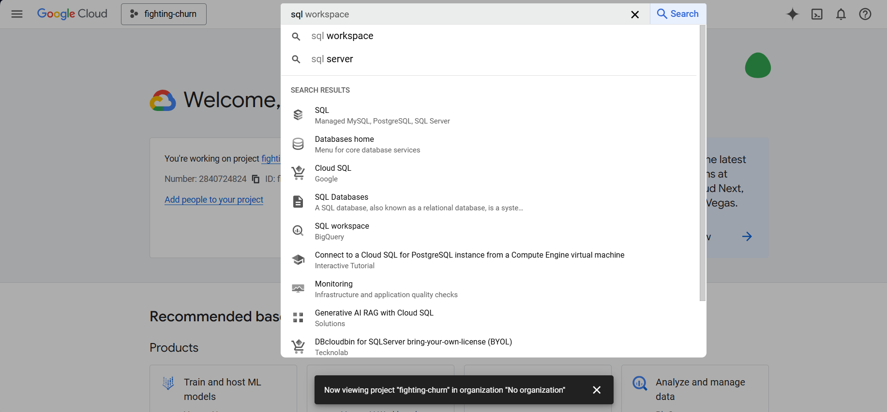

2. Click **Create instance** > Choose **PostgreSQL** > Click **Enable API** when prompted.

3. Choose **Enterprise Plus**.
4. Select a region (e.g. `southamerica-east1`) and choose a machine type (e.g. `N2 16 vCPU, 128gb`) with good resources for faster setup.
5. Name your instance (e.g. `churn-db`) and click **Create Instance**.

   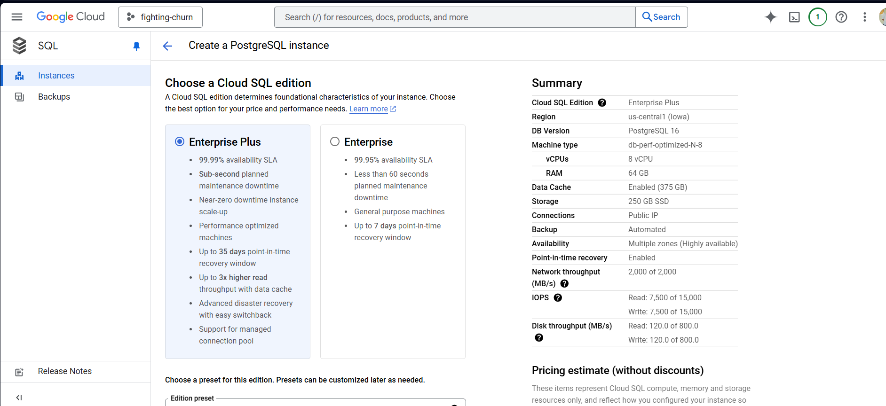
   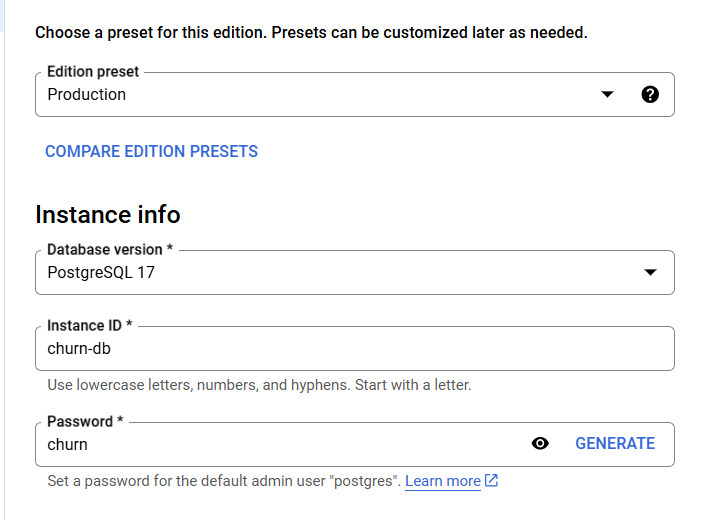

### 📁 Set Up a VM Instance

1. Search for **VM Instances** and click **Create Instance**.
2. Set region = same as your SQL instance. Zone = any.
3. Machine type: `e2-highcpu-16 (16 vCPU, 16 GB)`.
4. Name your VM, then click **Create**.

   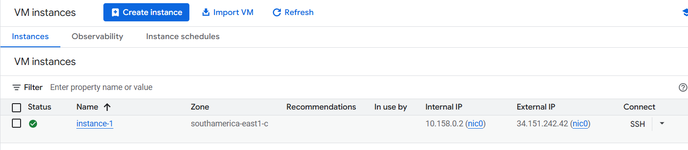
   
Wait for the VM to be ready. Once the green check appears under **status**, click **SSH** to open a terminal.

---

## ⚒️ Set Up Environment on the VM

   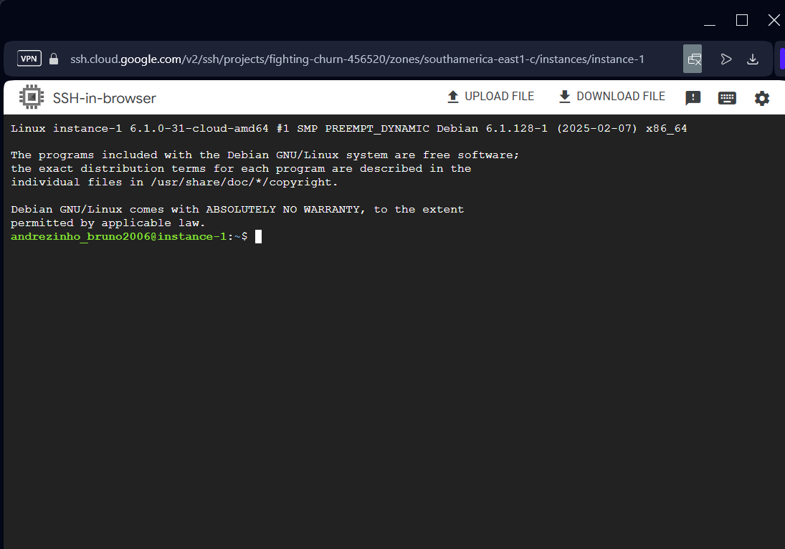


Create and run a shell script to install Python 3.9, dependencies, and the `fightchurn` package. Follow the commands:

```bash
nano setup_churn_vm.sh
```

Paste this script:

```bash
#!/bin/bash

# Update packages
sudo apt-get update
sudo apt-get upgrade -y

# Install dependencies
sudo apt-get install -y g++ wget build-essential libssl-dev zlib1g-dev \
libncurses5-dev libncursesw5-dev libreadline-dev libsqlite3-dev \
libgdbm-dev libdb5.3-dev libbz2-dev libexpat1-dev liblzma-dev tk-dev \
uuid-dev libffi-dev postgresql-client

# Install Python 3.9
wget https://www.python.org/ftp/python/3.9.18/Python-3.9.18.tgz
tar xvf Python-3.9.18.tgz
cd Python-3.9.18
./configure --enable-optimizations
make -j$(nproc)
sudo make altinstall
cd ..

# Set up virtual environment
python3.9 -m venv venv
source venv/bin/activate

# Install fightchurn
pip install --upgrade pip
pip install fightchurn

# Create output directory
mkdir churn_output

echo "✅ Python 3.9 + fightchurn environment ready!"
```

Save with `Ctrl+O`, Enter, and exit with `Ctrl+X`. Then run:

```bash
chmod +x setup_churn_vm.sh
./setup_churn_vm.sh
```

If sucessful, your terminal will look like this:
   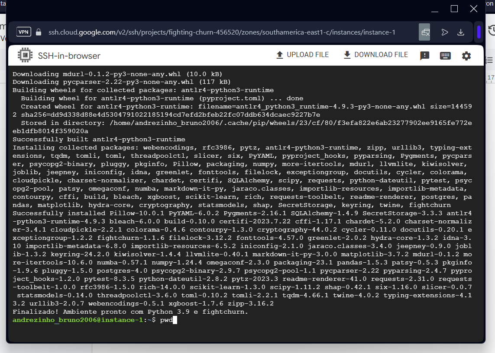

Use 
```bash
pwd
```
to find you username on GCP activate the environment like this:

```bash
cd /home/YOUR_USERNAME
source venv/bin/activate
```
You will see a “(venv)” beforte the directory. Do not close this window.

---

## 🔗 Connect VM to Cloud SQL

1. Copy your **VM external IP**.
   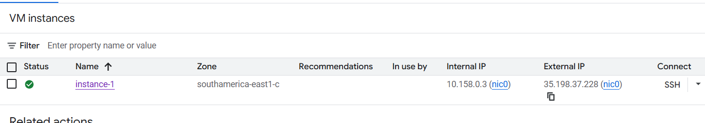
2. In SQL > Instance (churn-db) > Connections, add a new authorized network with your VM's **external IP**.

   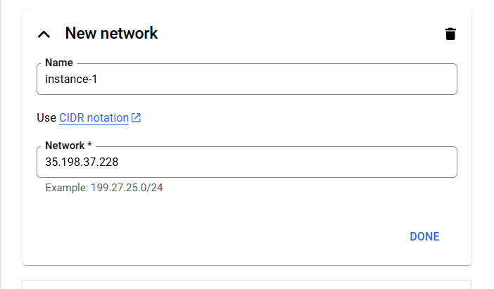
3. Copy the database instance Public IP
   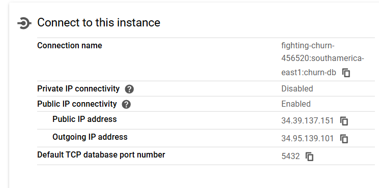

Then back in the VM terminal:

```bash
psql "dbname=postgres user=postgres hostaddr=YOUR_DB-INSTANCE_PUBLIC_IP"
```

Enter your password (e.g. `churn`) and create your database:

```sql
create database churn;
\q
```

---

## ✨ Run the Advanced Simulation

1. Activate your Python environment:

```bash
source /home/YOUR_USERNAME/venv/bin/activate
python
```

2. Run the simulation:

```python
from fightchurn import run_churn_listing

run_churn_listing.set_churn_environment('churn', 'postgres', 'churn', '/usr/src/churn_output', host='YOUR_DB-INSTANCE_PUBLIC_IP')
run_churn_listing.run_standard_simulation(schema='crm5', n_parallel=16)
```

Choose `crm5` when prompted. Wait for the simulation to finish.

   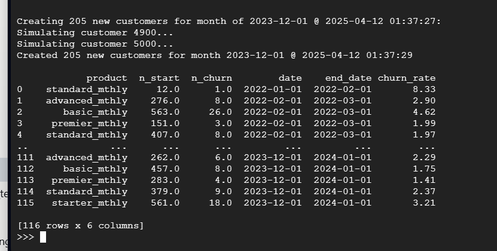

Now your database is populated. 

   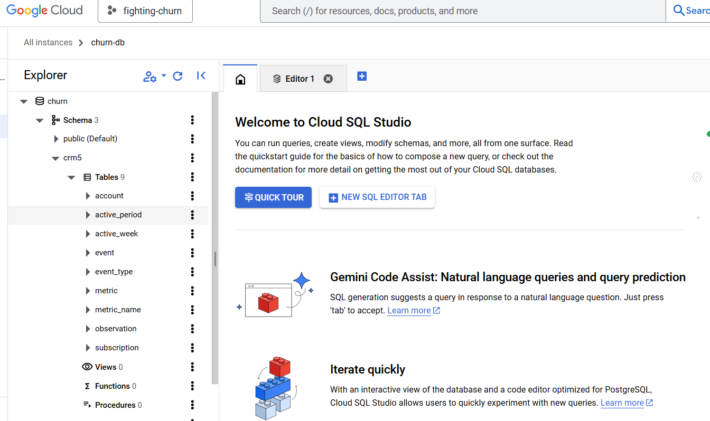


---

## 🛫 Export the Data to Local PostgreSQL (If you want)

### 1. On GCP:

- Go to your SQL instance > **Connections** > Add your **local IP address**. **[Find out your IP Address here](https://whatismyipaddress.com)**

### 2. On your PC (pgAdmin4):

- Create a new Server and connect to your GCP instance using Public IP from Database instance, username (e.g. 'postgres'), and password (e.g. 'churn').
   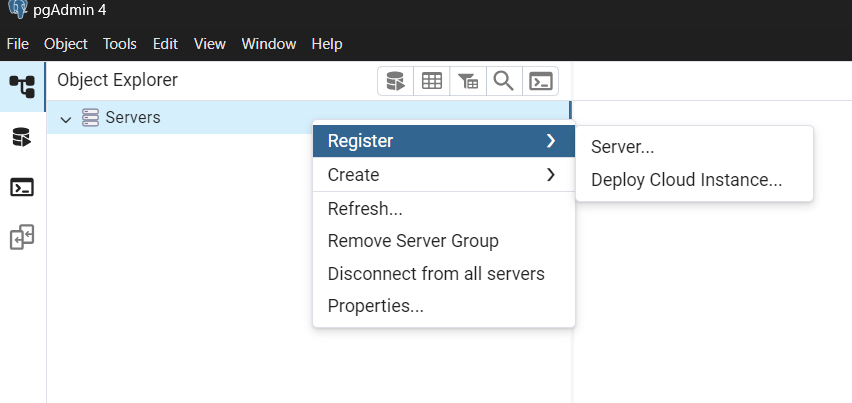
   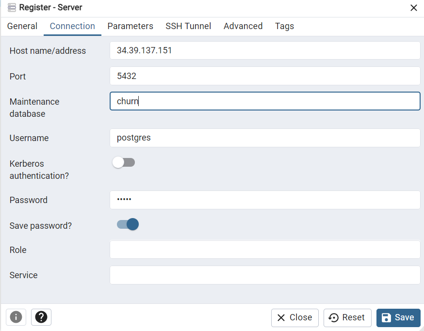

This will create a connection from your PC to your Database on GCP. Now you can backup the data. 
- Right-click `churn` DB on pgAdmin4 > **Backup** → Format: `Custom` → Save the file.

### 3. Create a Local DB:

- Right-click Databases > Create > `churn-local`

### 4. Restore:

- Right-click `churn-local` > Restore > select the `.backup` file (sometimes it will no appear as a '.backup', so search for "All files (*.*)"  → Run.
- Some warnings (e.g. `google_vacuum_mgmt`) and/or "Failed" status can be ignored.

   

---

## ⚠️ Cleanup to Avoid Charges

After completing your setup, **stop and delete your SQL and VM instances** on GCP to avoid billing (If you are not going to use it anymore).

---

## ❓ Questions?

If you need help, open an issue on GitHub or contact me on andrefeitosa9@gmail.com or **[my LinkedIn](https://www.linkedin.com/in/andrefeitosa/)**

Happy simulating! 🚀

