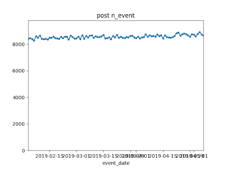
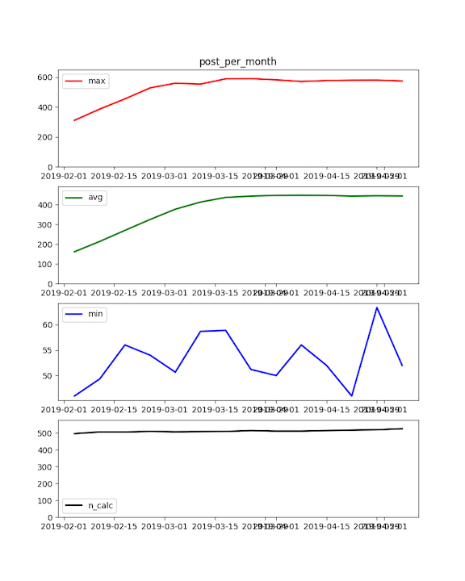

**Extras**

[3 Extras: Metric Calculation Framework](#metrics)  
[3.1 Event QA](#eventqa)  
[3.2 Batch Metric Calculation](#metcalc)  
[3.3 Metric QA](#metqa)  
[4 Extras: Dataset Export](#dataset)  


<a name="metrics"/>

## 3 EXTRAS: Calculating Metrics with a Framework

**Note that the code described in this section is not part of the book, Fighting Churn With Data. It is an extra example of code that the author used in his case studies. **

- The code described in this section is under the `extras` foder in the repository.

Running the code listing by listing is useful for when you are learning the techniques described the book. But once you have mastered the basics and you are trying to actually analyze churn for a live product or service you will need a more
efficient way to operate.  The code described in this section is a partially automated framework for calculating metrics
on events, and performing quality assurance (QA) checks associated with this process.  So these are all the topics
described in chapter 3, but this is a more scalable system for applying the techniques to a large data set than the 
example by example framework described in the last section.

---

<a name="eventqa"/>


### 3.1 Event QA

As described in the book, the first step in calculating metrics should actually be running some tests on your event
data.  This section of the code contains a script that will automatically run generate a QA plot for each event type,
as described in chapter 3.

The script that does is `metric-framework/event_qa.py`.  To run it, make a Run Configuration as described in Section 
1.2.2.4.  If you are running for the default simulated data set, `socialnet7` then the script is ready to run - just launch
it.  You should see output like the following:

```
/Users/user_name/fight-churn/venv/bin/python /Users/user_name/fight-churn/metric-framework/py/event_qa.py
Checking event post
Checking event new_friend
Checking event like
Checking event view_feed
Checking event photo
Checking event message
Checking event unfriend
Saving results to ../../../fight-churn-output/socialnet7/

Process finished with exit code 0
```

The output is a set of of png images shown in the folder indicated by the relative path on the last line: It is a 
folder nmaed `fight-churn-output` that is located adjacent to the repository folder.  The figures will look
like this:





You can also configure the QA to run on numeric event properties, if you events have any.  See the `event_properties`
field in the metric configuration described in section 3.2.2 (below). 

Note that the metric QA uses the metric configuration to run - it takes the start and end dates for the QA from the 
configuration. So if you are running on your own data you need to create the metric configuration (described in 
detail in the next section) before you can run this QA. (For the defaulted simulated data a configuration is already 
there for you.)

[(top)](#top)  

---

<a name="metcalc"/>

### 3.2 Calculating Metrics in Batch Jobs

After you are satisfied with the event data that has been loaded and is correct you can calculate metrics in batch jobs.
There are three parts to the metric framework:

1. Metric calculation SQL's in the `metric-framework/sql` folder
1. Metric configurations in JSONfiles in the `metric-framework/conf` folder
1. An execution program in python, `metric-framework/metric_calc.py`

Here is a high level overview of how it works:

* The SQL's calculate the metrics desribed in the book, but they have to be configured
  with things like the type name for an event or the time window for a measurement.
* The configuration of what parameters to bind in the SQL's are stored in  JSON in the `conf` directorynd
* Each database schema has its own configuration file, so if you are using the default simulated data
  `socialnet7` then the configuration for all of the metrics will be in `conf/socialnet7_metrics.json`. If you
   have loaded your own data in a schema called `saasco` you need to make and fill out a configuration 
   `conf/saasco_metrics.json`, etc.
* Each metric that will be calculated must have its own entry in the JSON for its schema, and there 
  is also a block of start and end date paramerters that are common to al the metrics.
* The Python program `metric-framework/metric_calc.py` reads the configuration for the schema passed as a parameter 
  and calculates the metrics.

The following sections provide details about each part of the framework.

#### 3.2.1 Metric SQL's

SQL's to calculate metrics are in the `metric-framework/sql` folder. These are the SQL's described in Chapter 3
(Measuring Customers) and Chapter 7 (Advanced Behavioral Metrics).  

* The SQL's all have bind parameters prefaced by `%`

For example, the metric for counting the number of events or aggregating an event property is:

```
set search_path = '%schema';
with date_vals AS (
  select i::timestamp as metric_date from generate_series('%from_date', '%to_date', '7 day'::interval) i
)

insert into metric (account_id,metric_time,metric_name_id,metric_value)

select account_id, metric_date,%metric_name_id, (%quotwin)::float/(%measwin::float) *  %fun
from event e inner join date_vals d
on e.event_time <= metric_date and e.event_time > metric_date - interval '%measwin week'
where e.event_type_id=%event_id
group by account_id, metric_date
order by account_id, metric_date;
```

The bind variables in the metric are:

1. `%schema`
1. `%from_date`
1. `%to_date`
1. `%event_id`
1. `%metric_name_id`
1. `%quotwin`
1. `%measwin`
1. `%fun`

These will be substituted by the program based on the configurations when it is run. 
Details of what the SQL does and the meaning of bind parameters are in the related sections
of chapter 3 and 7 in the book.

At the time of this writing the following metrics are available:

1. metric_multi_event_tenscale.sql
1. metric_over_period.sql
1. metric_over_period_tenscale.sql
1. metric_ratio.sql
1. metric_subscription_billperiod.sql
1. metric_subscription_mrr.sql
1. metric_subscription_product_quantity.sql
1. metric_subscription_unit_quantity.sql
1. metric_tenure.sql

---

#### 3.2.2 Configuring Metrics

To calculate metrics in batch jobs you need to configure the metrics specifically for your event data in a
configuration file for your schema.  For a simple example you can take a look at `metric-framework/conf/socialnet7_metrics.json`
which is setup to run for the default simulated data file.  The configuration is a set of named objects where the
key is the name of the metric that will be created (the name to be entered in the table `metric_name` in the database)
and the value is an object containing key/value pairs that are the bind variables for the SQL.  Here is an 
example from the `socialnet7` configuration:

```
    "date_range": {
        "from_date" :"2019-02-04",
        "to_date" : "2019-05-06"
    },,
	"event_properties" : [],
	"account_tenure": {
	    "sql" : "metric_tenure"
	},
	"post_per_month": {
		"event_id":  0,
		"fun" : "count(*)",
		"measwin" : 8,
		"quotwin" : 4,
		"minten" : 2,
		"sql" : "metric_over_period_tenscale"
	}
```

The entire configuration is a JSON of name/value pairs that is loaded as a dictionary in Python.  Each name maps
to another object which contains additional name/value pairs.

The first object in the configuration is a named `date_range` which contains the start and end dates for the
metrics to be calculated as `from_date` and `to_date`.

The second object is a list of properties that are in the event table - these will be included in the Event QA (described
above) if there are any.  (In the future there will be a simulated data set with event properties, but not yet...)

The third object is an example of a no-parameter metric, `account_tenure` (described in Chapter 3 of the book).
The only parameter in the object is the `sql` parmeter which indicates which SQL file (in `metric-framework/sql`)
is run to make the metric calculation.

The second object in the example configuration is a metric that has multiple parameters.
This configuration will create a metric named "post_per_month".  The `sql` parameter in the configuration object
 indicates which specific SQL to execute in order to create the metric : in this case it is the sql
  `metric-framework/sqls/metric_over_period_tenscale.sql`.  
 The other fields in the configuration  object will all be matched to bind variables in the SQL.

Each metric you create requires one configuration and the easiest way to create them is copy/paste and then modify
the existing configurations. For more examples of metric configurations (the `socialnet7` only has one example repeated)
look at the other sample file `metric-framework/conf/x_metrics.json`. 
(Unless you really need to make a lot - then its not so easy to make them manually and
you should spend some time automating that process as well.  Maybe that will be a future feature in this framework...)

---

#### 3.2.3 Running Metric Calculations

Once you have configured metrics (or if you are using the default `socialnet7`) you calculate the metrics with the
`metric-framework/metric_calc.py`.  You create a configuration for this script as described in Section 1.2.2.4 of this
README.  If you run the default configuration you should see this in your terminal (or the "Run" window in PyCharm):

```
/Users/cgold/projects/ChurnBook/fight-churn/venv/bin/python /Users/cgold/projects/ChurnBook/fight-churn/metric-framework/py/metric_calc.py
TRUNCATING *Metrics* in schema -> socialnet7 <-  ...
are you sure? (enter socialnet7 to proceed)
```

The program asks because if there were any metrics already saved, this program would wipe them out. If this is the first 
time there is no data but the script is not smart enough to check - just enter the schema name as shown and hit `<ENTER>`
and you should see the following, although it will take a bit of time: each metric will take some time to calculate:

```
/Users/cgold/projects/ChurnBook/fight-churn/venv/bin/python /Users/cgold/projects/ChurnBook/fight-churn/metric-framework/py/metric_calc.py
TRUNCATING *Metrics* in schema -> socialnet7 <-  ...
are you sure? (enter socialnet7 to proceed) socialnet7
Inserting metric socialnet7.account_tenure as id 0
set search_path = 'socialnet7'; with RECURSIVE date_vals AS (   select i::timestamp as metric_date from generate_series('2019-02-04', '2019-05-06', '7 day'::interval) i ), earlier_starts AS ( 	select account_id, metric_date, start_date 	from subscription inner join date_vals 		on start_date <= metric_date 		and (end_date > metric_date or end_date is null)  	UNION  	select s.account_id, metric_date, s.start_date 	from subscription s inner join earlier_starts e 		on s.account_id=e.account_id 		and s.start_date < e.start_date 		and s.end_date >= (e.start_date-31)  )  insert into metric (account_id,metric_time,metric_name_id,metric_value)   SELECT account_id, metric_date,0, extract(days from metric_date-min(start_date)) FROM earlier_starts group by account_id, metric_date order by account_id, metric_date;  
Inserting metric socialnet7.post_per_month as id 1
set search_path = 'socialnet7';  insert into metric (account_id,metric_time,metric_name_id,metric_value)  select m.account_id, metric_time, 1,     (4/ least(8,m.metric_value))  *  count(*) from event e inner join metric m     on m.account_id = e.account_id     	and event_time <= metric_time and event_time >  metric_time-interval '8 week' where e.event_type_id=0     and metric_name_id = 0     and metric_value >= 2     and metric_time between '2019-02-04'::timestamp and '2019-05-06'::timestamp group by m.account_id, metric_time, metric_value order by m.account_id, metric_time, metric_value; 
Inserting metric socialnet7.new_friend_per_month as id 2
set search_path = 'socialnet7';  insert into metric (account_id,metric_time,metric_name_id,metric_value)  select m.account_id, metric_time, 2,     (4/ least(8,m.metric_value))  *  count(*) from event e inner join metric m     on m.account_id = e.account_id     	and event_time <= metric_time and event_time >  metric_time-interval '8 week' where e.event_type_id=1     and metric_name_id = 0     and metric_value >= 2     and metric_time between '2019-02-04'::timestamp and '2019-05-06'::timestamp group by m.account_id, metric_time, metric_value order by m.account_id, metric_time, metric_value; 
Inserting metric socialnet7.like_per_month as id 3
set search_path = 'socialnet7';  insert into metric (account_id,metric_time,metric_name_id,metric_value)  select m.account_id, metric_time, 3,     (4/ least(8,m.metric_value))  *  count(*) from event e inner join metric m     on m.account_id = e.account_id     	and event_time <= metric_time and event_time >  metric_time-interval '8 week' where e.event_type_id=2     and metric_name_id = 0     and metric_value >= 2     and metric_time between '2019-02-04'::timestamp and '2019-05-06'::timestamp group by m.account_id, metric_time, metric_value order by m.account_id, metric_time, metric_value; 
Inserting metric socialnet7.view_feed_per_month as id 4
set search_path = 'socialnet7';  insert into metric (account_id,metric_time,metric_name_id,metric_value)  select m.account_id, metric_time, 4,     (4/ least(8,m.metric_value))  *  count(*) from event e inner join metric m     on m.account_id = e.account_id     	and event_time <= metric_time and event_time >  metric_time-interval '8 week' where e.event_type_id=3     and metric_name_id = 0     and metric_value >= 2     and metric_time between '2019-02-04'::timestamp and '2019-05-06'::timestamp group by m.account_id, metric_time, metric_value order by m.account_id, metric_time, metric_value; 
Inserting metric socialnet7.photo_per_month as id 5
set search_path = 'socialnet7';  insert into metric (account_id,metric_time,metric_name_id,metric_value)  select m.account_id, metric_time, 5,     (4/ least(8,m.metric_value))  *  count(*) from event e inner join metric m     on m.account_id = e.account_id     	and event_time <= metric_time and event_time >  metric_time-interval '8 week' where e.event_type_id=4     and metric_name_id = 0     and metric_value >= 2     and metric_time between '2019-02-04'::timestamp and '2019-05-06'::timestamp group by m.account_id, metric_time, metric_value order by m.account_id, metric_time, metric_value; 
Inserting metric socialnet7.message_per_month as id 6
set search_path = 'socialnet7';  insert into metric (account_id,metric_time,metric_name_id,metric_value)  select m.account_id, metric_time, 6,     (4/ least(8,m.metric_value))  *  count(*) from event e inner join metric m     on m.account_id = e.account_id     	and event_time <= metric_time and event_time >  metric_time-interval '8 week' where e.event_type_id=5     and metric_name_id = 0     and metric_value >= 2     and metric_time between '2019-02-04'::timestamp and '2019-05-06'::timestamp group by m.account_id, metric_time, metric_value order by m.account_id, metric_time, metric_value; 
Inserting metric socialnet7.unfriend_per_month as id 7
set search_path = 'socialnet7';  insert into metric (account_id,metric_time,metric_name_id,metric_value)  select m.account_id, metric_time, 7,     (4/ least(8,m.metric_value))  *  count(*) from event e inner join metric m     on m.account_id = e.account_id     	and event_time <= metric_time and event_time >  metric_time-interval '8 week' where e.event_type_id=6     and metric_name_id = 0     and metric_value >= 2     and metric_time between '2019-02-04'::timestamp and '2019-05-06'::timestamp group by m.account_id, metric_time, metric_value order by m.account_id, metric_time, metric_value; 

Process finished with exit code 0

```

The program prints out each metric as it inserts them into the metric name table and runs the SQL to insert the results
into the metric table.

The default of the program is calculate all the metrics for the `socialnet7` schema, but you can control this behavior 
with a constant saved at the top of the file `metric_calc.py` :

```
schema='socialnet7'

run_mets=None
# run_mets=['account_tenure','post_per_month']
```

If you uncomment the line `run_mets=[...` you can specify any list of metrics and when the script runs it will only calculate
those metrics.  This is useful because you normally iterate and can create additional metrics after investigating a first
group.

At this point you should check on the results of the metric calculation you have just run.  You could query the database
directly, or you can use the script described in the next section.

[(top)](#top)  

---

<a name="metqa"/>

### 3.3 Metric QA

The script `metric-framework/metric_qa.py` will create plots for metric QA (Quality Assurance) like the ones described
in Chapter 3 of the book.  To get started, just make a new Run Configuration (Section 1.2.2.4 of this README) and if
you are using the default `socialnet7` data set just run it.  You should see the following printout:


```
/Users/cgold/projects/ChurnBook/fight-churn/venv/bin/python /Users/cgold/projects/ChurnBook/fight-churn/metric-framework/py/metric_qa.py
Checking metric socialnet7.account_tenure
Checking metric socialnet7.post_per_month
Checking metric socialnet7.new_friend_per_month
Checking metric socialnet7.like_per_month
Checking metric socialnet7.view_feed_per_month
Checking metric socialnet7.photo_per_month
Checking metric socialnet7.message_per_month
Checking metric socialnet7.unfriend_per_month
Saving results to ../../../fight-churn-output/socialnet7/

Process finished with exit code 0
```

As described on the last line of the printout, results are saved in a directory named `fight-churn-output`  which is
alongside the `fight-churn` source directory.  (The confusing printout is the relative path from the 
script directory.)  Each of the plots produced by the script for the default `socialnet7` simulation data will look roughly
like this:

Note that the metric QA uses the metric configuration to run - it only runs on metrics that
are listed in the configuration and takes the start and end dates for the QA from the configuration.




[(top)](#top)  


<a name="dataset"/>

## 4 EXTRAS: Dataset Export

**Note that the code described in this section is not part of the book, Fighting Churn With Data. It is an extra example of code that the author used in his case studies. **

- The code described in this section is under the `extras` foder in the repository.

Chapter four of the book explains how to create a churn dataset from a database schema 
containing subscriptions and metrics. You can run each step of the process with the framework for running listings
(described above). But there are a few problems with doing it that way when you are iterating on different versions
of a dataset for a real project.

1. You want to run all the steps at once, not one at a time
1. The code does not clean out the results of prior runs, so you need to manually clear out the tables between executations.
1. The final select statement in the listings is hard coded to the metrics from one particular simualted data set

The code in the folder `dataset-export` handles these problems by making a single script that does everything. The python
script is `dataset-export/observe_churn.py`. To get started, just make a new Run Configuration 
(Section 1.2.2.4 of this README) and if you are using the default `socialnet7` data set just run it. The script prints out 
the SQL from each step, just like the script that runs the book SQL listings.  When it is done it should print
that it is saving the dataset:

```
...
Saving: ../../../fight-churn-output/socialnet7/socialnet7_dataset.csv
```

If you want to run this for your own dataset it accepts command line arguments to change the defaults:

* `--schema` : The name of the schema to run against
* `--frdt` : The earliest date to export, in the format YYYY-MM-DD
* `--todt` : The latest date to export, in the format YYYY-MM-DD
* `--interval` : The interval between the metric observations. Typically 7 days (if you followed the guidelines in the
  book.) Note that this is just telling the code about the metrics.

ALSO NOTE: You must set up the chapter 4 listing configurations (as described above) to use this! Thats because the
script actually imports and runs the listings 4.1, 4.2 and 4.4 as they are written. The `observe-churn.py` only differs
from the listing program in the final step where it does the export.

---

---

[(top)](#top)  