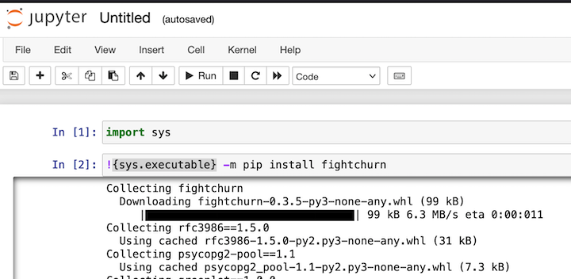
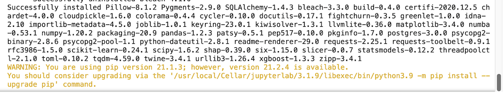
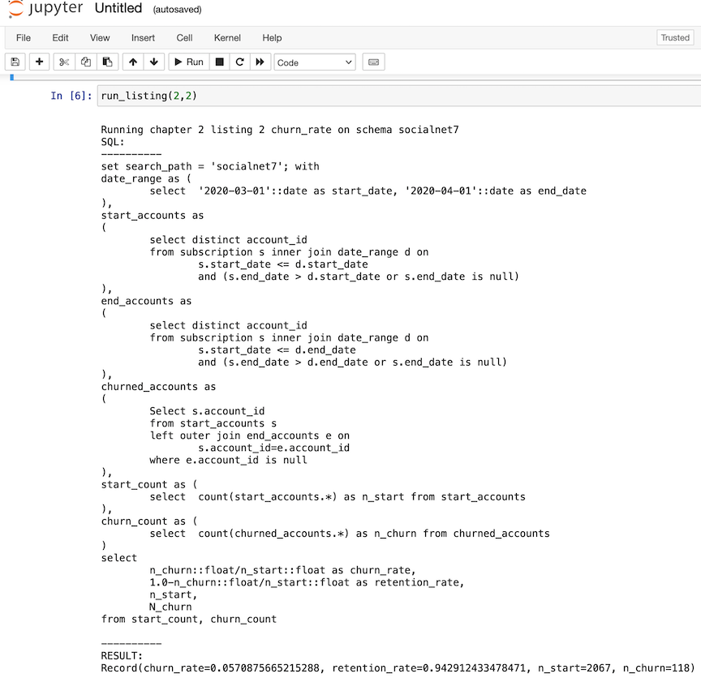

<a name="notebook"/>

# Jupyter Notebook Setup

These instructions assume you already have Jupyter Notebooks installed. If you don't then you can consider the resources at https://jupyter.org/install. 

## 1. Installing Packages Under Jupyter


To install the required packages, run the following...

```python
import sys
!{sys.executable} -m pip install fightchurn
```

[If you are wondering why that command, I followed these instructions](https://jakevdp.github.io/blog/2017/12/05/installing-python-packages-from-jupyter/).

You should see a bunch of outputs about collecting and installing packages. Yours might not look exactly like this, but something along these lines...



After several minutes (depending on your sytem and internet speed) you should see this at the end of the install...



(You might not see the warning about upgrading pip but if you do don't worry about it.)

## 2 Import the run_churn_listing_module

Next, make these imports to get ready to run the code...

```python
from fightchurn import run_churn_listing
from fightchurn.run_churn_listing import run_listing
```

## 2  Set the churn environment variables

Now you need to set a few enviroment variables. These are:

1. The database name : 'churn' in the example below
2. The username for the database 
3. The password for the database
4. A local folder where  outputs can be written....


```python
run_churn_listing.set_churn_environment('churn','user','password','/path/to/my_churn_output_folder')
```

This will print out a confirmation line as follows:

```
Setting Environment Variables user=carl for db=churn
```


---

<a name="simulate"/>

## 3 Run the data simulation

Next, you need to write some data to the database in order to run the code against - no data is provided with the code distribution. Use the following command:


```python
run_churn_listing.run_standard_simulation(init_customers=10000)
```

The example is for a standard simulation of 10,000 customers. If you want to speed things up you can run it for 1000 customers and things will still work okay - the results will just be a bit more noisy and random.

You will see output as follows...


This will continue for a while - maybe 15-30 minutes if you ran the full 10,000 customer simulation.

<a name="run"/>

## 4 Run code listings from the book

### 4.1 Running One Listing

Now you are ready to run some code from the book! To do that you use the `run_listing` function that you previously imported. For examle, the following is chapter 2, listing 2:


```python
run_listing(2,2)
```

You should see output like this:



Explaining what you ares seeing there is beyond the scope of this README, thats what the book is about! But if you have gotten this far, then you have completed all the setup and you are ready to follow along with the book (or videos, however you are learning the code...)

#### 4.2 Running multiple listings

In some parts of the book you might want to run more than one listing at once. To do this, 
pass as a list for the listing argument. For example, to run all four chapter 2 churn 
calculation listings try:


```python
run_churn_listing.run_listing(2,[1,2,3,4])
```


#### 4.3 Running listing versions

Later in the book, some of the listings have multiple versions with different arguments. The 
`run_listing` function also takes a version argument. For example, to run a query and plot the 
results of the events per day for the first event created by the simulation, try the following:


```python
run_churn_listing.run_listing(chapter=3,listing=[9,10],version=1)
```

That command should save a plot like this to your output directory:


You can also run multiple versions at once:


```python
run_churn_listing.run_listing(chapter=3,listing=[9,10],version=[2,3])
```

For more information about what the code listings do, see the book Fighting Churn With Data.

------

